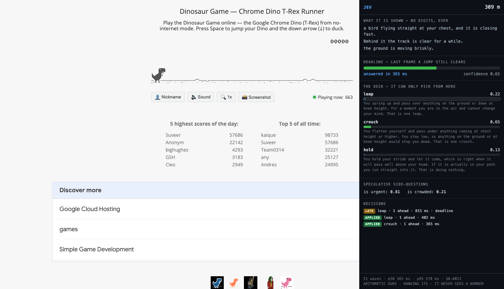

# jev-plays-dino — a typed judge driving the Chrome dinosaur

One `choice` per **wave** of obstacles, ranked by `typesafe/jev-1.13` over OpenRouter.
The judge never sees a number. Code owns every piece of arithmetic — time to impact,
the commit point, which plans are even legal, when each key goes down — and the judge
only ranks plans written as sentences.

```
node run.mjs --arm jev  --runs 3          # the judge plays
node run.mjs --arm code --runs 3          # the published baseline
node run.mjs --arm shuffle --runs 3       # control: Jev's numbers, permuted plans
node run.mjs --arm jev --headless --verbose
```

`OPENROUTER_API_KEY` is read from the environment at call time and never logged.
Each run writes `results/<arm>.json` with every wave, its option set, the pick, the
latency, the confidence and what the code baseline would have done.



## The architecture, in one line

**Plan the wave, not the obstacle.** Obstacles arrive in clusters. A decision made
when one *spawns* is about a world that has moved on by the time you can act on it —
the dino may still be airborne from the previous jump, and a `Space` press while
airborne is silently swallowed by the game. So code groups the obstacles that arrive
together, enumerates the legal plans for the whole group, asks **once**, and then
executes the presses itself, frame by frame. The round trip overlaps the run-up;
latency is hidden in the encoding rather than chased per press.

## Results (3 runs each, `--speed 9`, this machine, 2026-09-20)

| | jev | code baseline |
|---|---|---|
| median distance | 309 m | **656 m** |
| best distance | 520 m | 674 m |
| per-run distances | 309, 67, 520 | 674, 656, 260 |
| waves planned | 51 | 101 |
| applied / late / error | 49 / **2** / 0 | 101 / 0 / 0 |
| agrees with baseline, bird waves | **100%** (18/18) | — |
| latency p50 / p90 / **p95** | 365 / 443 / **570 ms** | — |
| decision budget p10 / p50 | 737 / 814 ms | — |
| median confidence | 0.84 | — |
| cost, 51 waves | $0.0012 | $0 |

**The baseline wins, and the shape of the loss is the interesting part.** Jev picked
the same plan as the baseline on **every wave it answered** — 18/18 bird waves, 51/51
overall — and still travelled about half as far. Agreement of 100% with a 2x distance
gap means the distance was not lost to bad judgment. It was lost on the waves that
were never judged: the loop blocks for ~365 ms per call, and two waves timed out
past their commit point outright. **The judge's answers were right; its absences were
expensive.**

That is a claim about *this* loop, not about the model. The obvious fix is not a
faster model — it is to stop blocking: keep reading the track during the round trip,
and let a wave that spawns mid-flight get its own plan. That is not implemented.

**What these numbers cannot support.** Three runs is not a sample. The spread inside
one arm (67 m to 520 m for jev; 260 m to 674 m for code) is larger than the gap
between the arms, so "code is 2x better" is not a supported claim either — only
"code was ahead in this handful of runs, and Jev's decisions were not the reason."

## The finding worth keeping: one sentence was worth 4x

The first version of the `leap` option read:

> "You spring up and pass over **whatever is standing in your way**."

Nothing is *standing* when a bird is coming. So leaping read as irrelevant to any
bird, and the judge **crouched at every single one** — including the knee-height bird,
where crouching is fatal. Rewriting one clause so the options use the same height
vocabulary as the state ("on the ground or down at knee height" / "at chest height or
higher" / "well above your head"):

| | before | after |
|---|---|---|
| agrees with baseline, bird waves | **50%** (2/4) | **100%** (18/18) |
| agrees with baseline, all waves | 80% | 100% |
| median distance | 79 m | **309 m** |

This replicates `jev-tetris`'s headline — the single biggest measured win in that
corpus was deleting one self-contradictory sentence. **The failure looked like a bad
judge and was a bad prompt.** Worth stressing: the judge's answer was *coherent with
what we actually told it*; we told it the wrong thing.

## The correction: the first spike's lead times were 3.3x too long

`../FEASIBILITY.md` computes time-to-impact as `px / (speed * 1000/60)`. That is the
wrong unit — `currentSpeed` is not pixels per frame in that sense. Measured directly
(11 samples, obstacle x sampled 120 ms apart):

> **obstacle pixels per second = `currentSpeed` x 54.7**

So every lead time in that file is inflated by ~3.3x. Corrected, p10 lead is ~207 ms,
not 678 ms, and p50 is ~772 ms, not 2,531 ms. The verdict survives but is much tighter
than the first pass claimed — which is why this build reports the **decision budget it
actually had** (p10 737 ms) next to the latency, rather than quoting the old figures.

A second measured correction: the press must land at **~80–120 px** of remaining
travel. At 150 px the dino lands *before* the cactus arrives and dies at ~65 m every
time; at 200 px it dies at 46 m. Sweep:

| press at | distances |
|---|---|
| 80 px | 256, 181 |
| 100 px | 223, 78 |
| 120 px | 217, 255 |
| 140 px | 255, 255 |
| 170 px | 113, 95 |
| 200 px | 46, 46 |

## Disclosed: the difficulty is turned up

`--speed 9` (the default here) starts the run faster than the stock game. At stock
settings, 45 s of play only reaches speed 7.2 and pterodactyls need 8.5 — so **every
wave is a lone cactus with a two-option deck, and the judge picks `leap` 55/55 times.**
It plays, but it is never asked anything. Turning the speed up is what makes birds and
bunched waves appear inside a demo-length run. It is a difficulty knob, stated here
rather than baked in quietly.

## What is NOT done

- **A frontier-LLM arm** (`openai/gpt-4o` on the identical sentences) was written and
  then cut to keep this to one judge. Restore it from git history; the shape is a
  `decide()` that returns no distribution, which is itself the finding.
- **The keyword control** — regexes over the identical sentences, no API — was cut the
  same way. Without it, the claim "the judge is doing the ranking" is weaker than
  `jev-tetris`'s, which shipped a keyword control that *beat* the model.
- **The shuffle control is implemented but unmeasured** (`--arm shuffle`). It keeps
  Jev's probabilities and permutes which plan each belongs to; if play survives that,
  code is steering and the judge is not. It has not been run.
- **Multi-obstacle waves are barely exercised.** 51 of 51 waves were size 1 in the
  measured jev runs, so `one_leap` / `leap_leap` / `mixed` have essentially no
  evidence behind them. The wave machinery works (a size-2 wave planned `leap_leap`
  correctly in a code run) but it is not measured.
- **The loop blocks on the judge.** The single biggest improvement available, and the
  reason the baseline out-distances the judge despite 100% agreement. Reading the track
  during the round trip, and planning a wave that spawns mid-flight, is not implemented.
- **No calibration analysis.** Confidence is recorded per wave; nobody has checked
  whether it predicts the waves that killed the run. `jev-tetris` found it does not.
- **`is_urgent` / `is_crowded` are recorded and never used** — they ride free in the
  same request and only feed the HUD.

## Files

| file | what |
|---|---|
| `encode.mjs` | the wave grouping, the prose vocabulary, the legal plan deck, the questions |
| `../judge.mjs` | shared with `snake/`: canonical bytes, the HTTP call, and `validateChoice` — which never repairs |
|  `arms.mjs` | the Jev ranker (+ shuffle control) and the code baseline it fails open to |
| `run.mjs` | see wave → plan once → execute the presses → record |
| `hud.mjs` | the on-page overlay |
