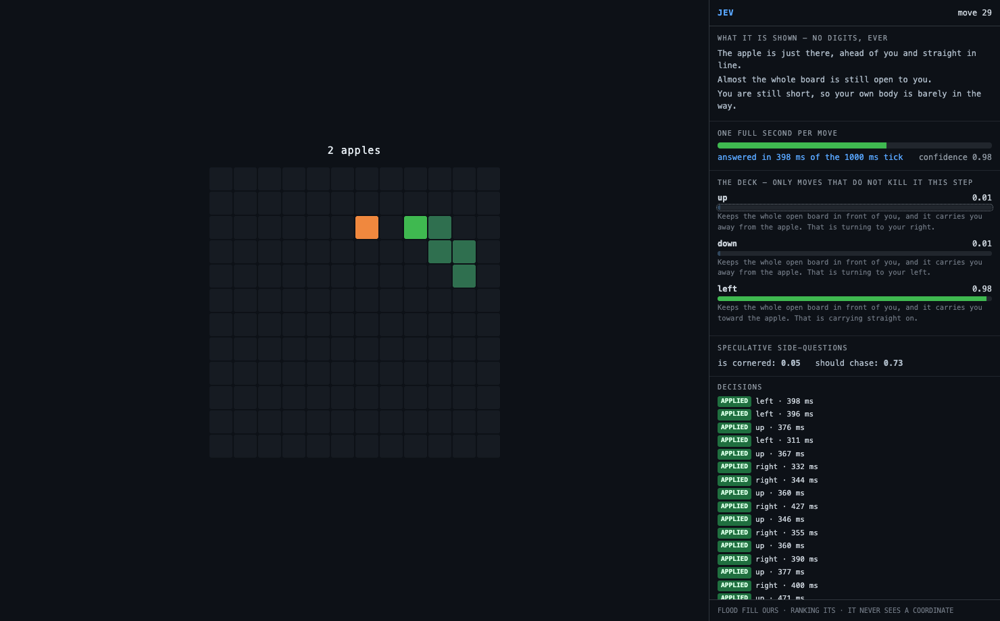

# jev-plays-snake — a one-second budget, so the judgment is what gets measured

One `choice` per move, ranked by `typesafe/jev-1.13` over OpenRouter, on a 12x12
board with **a full second per tick**. The judge never sees a number: not a
coordinate, not a distance, not a square count, not its own length. Code runs the
flood fill, measures the apple, works out which moves are even legal — and hands
over the conclusion as a sentence.

```
node run.mjs --arm jev --games 3            # the judge plays
node run.mjs --arm code --games 3           # the baseline, no API calls
node run.mjs --arm shuffle --games 3        # control: Jev's numbers, permuted moves
node run.mjs --arm jev --ui                 # watch it, one move per second
node run.mjs --arm jev --ui --shot x.png --out scratch   # illustrate without
                                                         # clobbering a measurement
```

`OPENROUTER_API_KEY` is read from the environment at call time and never logged.
Every arm plays the **same seeds**, so the boards and apple placements are identical
across arms and the only variable is who chose the moves.



*A real move: `left` at 0.98 against two 0.01s, answered in 398 ms of the 1000 ms
tick, with the deadline bar showing how much budget was left and the two speculative
nouls riding along in the same request.*

## Why this game exists

The sibling build, [`../dino`](../dino), is latency-bound. Its decision budget is
~800 ms, the round trip is ~365 ms, and the loop blocks while it waits — so what that
demo measures is **the round trip**, not the judgment. Jev agreed with the baseline on
100% of dino waves and still travelled half as far, purely on the waves it never got
to judge.

Snake at a one-second tick removes that. p95 latency here is **554 ms — 55% of the
budget** — so a decision essentially always lands. What is left to measure is whether
the judge picks well, which is the actual question.

Running the game in Node rather than scraping a site is the second half of that
choice. The dino build spent an hour on jump physics and pixel-per-frame units, which
taught nothing about typed decisions. Here the board is a data structure, the moves
are seeded, and there is nothing to reverse-engineer.

## Results (3 games each, same seeds 1–3, 150-move cap, 2026-09-20)

| | jev | code baseline |
|---|---|---|
| apples per game | 17, 17, 17 | 15, 18, 17 |
| median apples | **17** | **17** |
| deaths | 0 | 0 |
| moves that boxed it in | **0** | 0 |
| decisions (judged / forced) | 444 / 6 | 446 / 4 |
| applied / late / error | 439 / **5** / 0 | — |
| **agrees with the baseline** | **64%** | — |
| latency p50 / p90 / **p95** | 373 / 478 / **554 ms** | — |
| p95 as a share of the tick | **55%** | — |
| median confidence | 0.81 | — |
| cost, 444 decisions | $0.0106 | $0 |

**The result worth stating: it matched a hand-tuned greedy bot while playing a
visibly different game.** (But see the ablation below: agreement with the baseline is
*not* a quality measure — the `raw` encoding agrees more and scores worse.) Identical median apples, zero deaths, zero self-trapping
moves — off a policy that agrees with the baseline only about two thirds of the time.
The 36% of moves where it went its own way cost it nothing.

That is a stronger claim than "it plays snake", and a narrower one than "it plays
snake well". It is: *given only prose, and with arithmetic kept entirely in code, the
judge ranks moves well enough to match the baseline's score without copying the
baseline's policy.*

## Uncapped: what happens when games are allowed to end

The table above caps games at 150 moves, and nothing ever died. Uncapped (600-move
safety valve, not a target), the snake gets long and starts running out of board:

| | jev/prose | code baseline |
|---|---|---|
| apples | 40, 24, 38 | 47, 32, 40 |
| median apples | 38 | **40** |
| moves survived | 487, 311, 600 | 526, 435, 589 |
| deaths (all self-trapped) | 2 of 3 | 3 of 3 |

**The baseline is ahead in the endgame, and the expected mechanism did not materialise.**
The prediction was that prose would win here: greedy-toward-apple is exactly the policy
that walks into a pocket, and the encoding has a clause for it ("shuts you into a
pocket smaller than your own body"). It did not play out — the judge trails slightly,
and dies the same death. Three games, so the gap is not significant either; what is
reportable is the absence of the predicted win, not a loss.

## The control that could have killed the thesis, and did not

Keep Jev's probabilities exactly as returned, then **permute which move each one
belongs to** before picking the argmax. Same board, same seeds, same sentences, same
API calls — only the mapping from number to move is scrambled. If play survives that,
the code was steering and the judge was decoration.

| | jev | jev + shuffle | code baseline |
|---|---|---|---|
| apples per game | 17, 17, 17 | **1, 0, 1** | 15, 18, 17 |
| median apples | 17 | **1** | 17 |
| agrees with the baseline | 64% | **37%** | — |
| deaths | 0 | 0 | 0 |

**Play collapses.** Seventeen apples becomes one. Agreement with the baseline falls to
36.7%, which is about what picking at random from a two-or-three-move deck gives you.
The snake still never dies — it cannot, because the deck only ever contains moves that
are legal *this step*, so code keeps it alive while the ranking sends it nowhere. That
separation is the useful part: **staying alive is the deck's doing, eating is the
judge's.**

This is the check `jev-tetris` ran and almost nobody else does. Without it, the
64%-agreement number above is suggestive of nothing in particular; with it, the claim
"given only prose, the judge ranks these moves well enough to match a hand-tuned
greedy bot" has a control behind it.

## The encoding ablation — four ways of saying the same thing

Same game, same seeds, same legal-move deck, same baseline, same one-second tick.
The only thing that varies is how the board and the options are worded.

| style | what changes | apples | agrees w/ baseline | median confidence | moves into a pocket smaller than itself |
|---|---|---|---|---|---|
| **prose** | the encoding this repo argues for | **17, 17, 17** | 0.63 | **0.80** | 0 |
| **stale** | one clause frozen, no longer tracks the board | 17, 17, 17 | 0.64 | 0.82 | **3** |
| **raw** | the same facts as numbers | 12, 15, 14 | 0.70 | 0.62 | 1 |
| **labels** | bare option ids, no descriptions | **0, 1, 0** | **0.29** | **0.29** | 0 |
| *(jev+shuffle, for scale)* | *prose, numbers permuted onto wrong moves* | *1, 0, 1* | *0.37* | — | 0 |

### 1. The option sentences carry the judgment. The state description does not.

`labels` keeps the full prose board description and replaces each option with its own
id — `"up"`, `"down"`, `"left"`. Play collapses to **zero apples**, agreement falls to
0.29 (chance, over a two-or-three-move deck), and it lands in the same place as the
shuffle control. Telling the judge where the apple is buys nothing if the options are
not described; every bit of usable signal was in the sentence attached to each move.

This is exactly the shape the one existing Wordle repo ships —
`jev-plays-wordle` uses `criteria={w.upper(): None for w in options}`, no per-option
description at all. On this evidence that is not a weak encoding, it is an inert one:
the model is ranking at chance and the harness's legality filter is doing all the
visible work.

### 2. Numbers cost 18% — real, but not the collapse the docs imply

`raw` hands over `x=5,y=6`, `room=142`, `food_distance=9`. Apples drop from 17 to 14.
Worth being precise about, because the jaggedness note ("does not count reliably") can
be read as predicting failure: it does not fail, it degrades. Confidence drops with it,
0.80 → 0.62.

A wrinkle that matters more than the 18%: **`raw` agrees with the baseline MORE than
prose does (0.70 vs 0.63) and scores WORSE.** Agreement with a greedy bot is therefore
not a quality measure, and the 64% figure quoted elsewhere in this file should not be
read as one. It measures similarity of policy, nothing else.

### 3. A stale clause costs 34% — but only once games are allowed to end

`stale` freezes the room clause so every option opens with "Leaves you plenty of room
to keep moving" regardless of the actual board. It was built to reproduce the dino bug.

**Under the 150-move cap it looked free: 17, 17, 17 — identical to prose.** Uncapped,
with games ending when the snake dies:

| | prose | stale | code baseline |
|---|---|---|---|
| apples | 40, 24, 38 | **14, 25, 32** | 47, 32, 40 |
| median apples | 38 | **25** (−34%) | 40 |
| moves survived | 487, 311, 600 | **126, 242, 377** | 526, 435, 589 |
| median moves | 466 | **242** (−48%) | 526 |

**The clause was never free; the measurement was blind.** A capped game never lets the
snake get long enough for a bad room call to kill it, so the cost of deleting the room
signal is invisible until games are allowed to end. Every number in the capped table
above is a lower bound for exactly this reason.

**And a metric retracted.** An earlier version of this file treated "moves into a
pocket smaller than the snake" as a safety measure, on the strength of stale scoring 3
against prose's 0. The uncapped run kills that reading: the **code baseline makes the
most such moves of any arm — 49, a rate of 3.2% per move against prose's 1.4% — and
it also survives longest and scores highest.** Moving through a tight space is normal
and survivable in late-game snake; the count scales with how long the snake gets, so
comparing raw counts across runs of different lengths measures length, not danger.
The metric is still recorded, and should not be read as a quality signal.

It also sharpens what the dino bug actually was. A clause that is uniformly
uninformative across options costs little — it carries no signal, but no lie either.
The dino clause was *differentially* wrong: "over whatever is standing in your way"
made exactly one option read as irrelevant to exactly one obstacle type. **Constant
noise is cheap; selective misdirection is not.**

### 4. Confidence collapses when the encoding says nothing

| style | median confidence |
|---|---|
| stale | 0.82 |
| prose | 0.80 |
| raw | 0.62 |
| labels | **0.29** |

Note that this ranking does **not** match the quality ranking — `stale` is the worst
working encoding and carries the highest confidence. What the number detects is an
encoding that gives the judge nothing to rank on, not one that gives it something
wrong. The next section takes that apart.

## What confidence actually tracks: constraint, not correctness

Three separate observations, and one reading that fits all of them.

| observation | confidence |
|---|---|
| moves agreeing with the baseline vs diverging from it | 0.87 vs 0.54 |
| encodings that say something vs an encoding that says nothing (`labels`) | 0.80 vs **0.29** |
| moves into a tight pocket vs the rest (prose / stale) | 0.67 vs 0.75 · 0.55 vs 0.79 |

In every case the judge is less sure when the position is more constrained or the
information is thinner — **not when its answer is wrong.** `stale` is the proof: it
carried the *highest* median confidence of any style (0.82) while being the worst
encoding of the three that work. Confidence is a read on the question, not on the
answer.

That has a practical edge and a practical limit. The edge: a confidence distribution
sitting near the uniform floor is a detectable symptom of a broken encoding, visible
from responses alone, with no baseline and no ground truth — a health check you could
run on live traffic. The limit: it cannot tell a good encoding from a subtly wrong one,
because a wrong-but-confident-sounding question still reads as answerable.

### Does it predict death? One case says yes, one says no, and two is not evidence

Uncapped, prose died twice in three games. Median confidence over the last ten moves
before the end, against the rest of that game:

| game | ended | last 10 moves | earlier |
|---|---|---|---|
| seed 2 | died, no legal move left | **0.29** | 0.76 |
| seed 1 | died, no legal move left | 0.72 | 0.77 |
| seed 3 | survived to the move cap | 0.65 | 0.73 |

One death was foreshadowed by a total confidence collapse. The other was not
foreshadowed at all. **Two deaths cannot support a claim either way** — this is
recorded so the next run has something to compare against, not as a finding.
`jev-tetris` reported no signal here; this is, at best, "maybe sometimes".

## Appendix: confidence separates the agreements from the divergences

| | median confidence |
|---|---|
| moves where it picked what the baseline picked (284) | **0.87** |
| moves where it diverged (160) | **0.54** |

The judge is markedly less sure precisely when it is doing something the baseline
would not. That matters because `jev-tetris` reported the opposite — its one
catastrophic turn came back at 0.48, "right at the run average", so confidence carried
no signal there. Here it does.

**Do not over-read it.** This says confidence tracks *divergence from a greedy bot*,
which is not the same as tracking *being wrong* — none of these divergences killed it,
so there are zero bad outcomes to correlate against. The honest version: on this
board, confidence is a usable "I am off the obvious line" flag, and whether it is also
an "I am about to die" flag is untested, because it did not die.

A second signal from the free-riding nouls: `is_cornered` sat at a median of 0.07
across all 444 moves — it never thought it was trapped, and it never was. `should_chase`
sat at 0.53, i.e. genuinely undecided about risk-taking, all game.

## Where the budget actually went

Five moves out of 444 came back past the one-second deadline (max 1002 ms) and fell
through to the baseline, labelled `LATE` on screen and in the record. That is a 1.1%
fallback rate at a 1 s budget, against roughly 4% at the dino's ~800 ms budget with a
tighter tail. The gap between p50 (373 ms) and max (1002 ms) is the thing to size a
budget against — **p95, not the median**, which is the number the published corpus
does not report.

## What is NOT done

- **A keyword control** — regexes over the identical sentences, no API — is not
  written. `jev-tetris` shipped one and it *beat* the model; without it this repo's
  claim is weaker than that one's.
- **Three games is not a sample.** The baseline's own spread was 15 to 18 apples,
  which is as wide as any gap being claimed. Nothing here supports a ranking between
  the arms.
- **The ablation needs the uncapped run to mean anything.** `stale` scored identically
  to `prose` and still produced the sweep's only cluster of self-trapping moves. Under
  a cap, the score metric cannot see harm that only kills a long snake. Every number in
  the ablation table is therefore a lower bound on the damage a bad encoding does.
- **Nothing died.** Every game hit the 150-move cap instead, so there is no
  failure data at all: no calibration against death, no trap analysis, no endgame.
  The interesting part of snake — a long snake navigating its own body — is untested.
  Raise `--max-moves` and remove the cap to get there.
- **`should_chase` is recorded and never used.** It rides free in the same request
  and only feeds the HUD; nothing acts on it.
- **One board size, one tick.** `--tick` and the 12x12 constants exist but no sweep
  was run, so "a second is enough" is measured at exactly one setting.

## Files

| file | what |
|---|---|
| `game.mjs` | pure seeded snake: the board, legal moves, the flood fill, the apple |
| `encode.mjs` | the prose vocabulary, the option template, the questions |
| `arms.mjs` | the Jev ranker (+ shuffle control) and the baseline it fails open to |
| `run.mjs` | the tick loop and the report |
| `view.mjs` | the on-page board + judge panel |
| `../judge.mjs` | shared with `../dino`: canonical bytes, and `validateChoice`, which never repairs |
